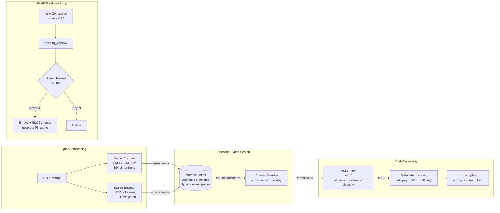
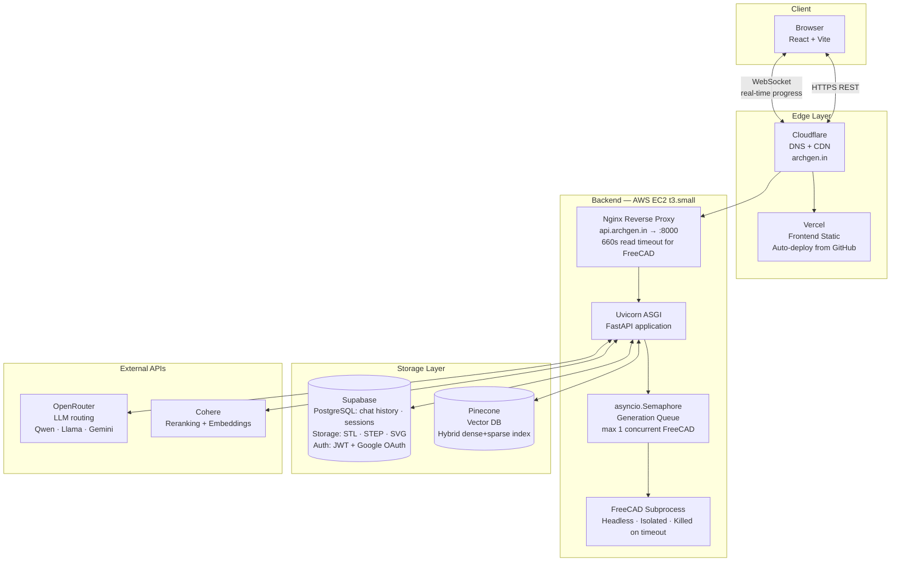

# ArchgenCAD | Autonomous Text-to-CAD Generation System

<div align="center">

> **Convert natural language engineering prompts into verified, executable 3D CAD models, fully autonomously.**

https://drive.google.com/file/d/178DGryJ9uAnrNcoaxoB6Ebb2siIE-0cZ/view?usp=sharing

</div>

---

## What is ArchgenCAD?

ArchgenCAD is a production agentic AI system that takes a plain-language engineering prompt and returns a verified, executable FreeCAD Python script that produces a real 3D solid model — including STL, STEP, FCStd exports and an auto-generated 2D engineering drawing.

**Input:** `"Design a heavy-duty compression spring with 12mm wire diameter, 40mm coil radius, 200mm height, 25mm pitch"`

**Output:**
- ✅ Verified FreeCAD Python script (executes headlessly, produces real geometry)
- ✅ STL + STEP + FCStd files (downloadable)
- ✅ Auto-generated 2D engineering drawing SVG
- ✅ Physics validation report
- ✅ Quality score with per-axis breakdown

> **Note:** This repository contains the system architecture, pipeline documentation, and design decisions. The production codebase is proprietary.

---

## Demo

> 🎥 Demo video embedded here — shows real-time generation of a compression spring, gear blank, and spiral staircase.

---

## System Overview

ArchgenCAD is built around a **multi-agent, multi-model orchestration pipeline** with 9 specialized agents, a hybrid RAG retrieval system, iterative refinement with cross-iteration memory, and a production queue that serializes FreeCAD execution for memory safety.

The system runs entirely **autonomously** — from raw text to verified 3D geometry — with no human in the loop during generation.

```
Natural Language Prompt
         ↓
  [8-Stage Agentic Pipeline]
         ↓
Verified 3D CAD Model + Engineering Drawing
```

---

## Architecture

### Full System Architecture

```mermaid
flowchart TD
    USER([🧑 User Prompt\nNatural Language]) --> QUEUE

    subgraph QUEUE_LAYER["🔒 Generation Queue Layer"]
        QUEUE{Queue Guard\nasyncio.Semaphore}
        QUEUE -->|Queue full ≥3| REJECT([503 Server Busy])
        QUEUE -->|Slot available| WS_NOTIFY
        WS_NOTIFY[WebSocket: Position in Queue]
        WS_NOTIFY --> ACQUIRE[Acquire Semaphore\nBlock until prev. FreeCAD done]
    end

    ACQUIRE --> STAGE1

    subgraph PIPELINE["🤖 8-Stage Agentic Pipeline"]
        direction TB

        subgraph STAGE1["Stage 1 · Prompt Validation Agent"]
            PV_IN[Raw User Prompt] --> PV_CLASSIFY[Intent Classification\nMechanical / Architecture / Custom]
            PV_CLASSIFY --> PV_GUARD{Guardrail\nCheck}
            PV_GUARD -->|Non-CAD / Harmful| PV_REJECT([Reject with reason])
            PV_GUARD -->|Ambiguous| PV_CLARIFY([Request Clarification])
            PV_GUARD -->|Valid CAD intent| PV_ENHANCE[Prompt Enhancement\n+ Component Planning\n+ Constraint Extraction\n+ Scope Bounding]
            PV_ENHANCE --> PV_OUT[Enhanced Prompt\n+ Requirements Dict]
        end

        PV_OUT --> STAGE2

        subgraph STAGE2["Stage 2 · Hybrid RAG Retrieval"]
            RAG_IN[Enhanced Prompt] --> RAG_DENSE[Dense Embedding\nall-MiniLM-L6-v2 → 384-dim]
            RAG_DENSE --> RAG_PIN[Pinecone Query\nTop-10 candidates]
            RAG_IN --> RAG_SPARSE[BM25 Sparse Encoding\nKeyword-weighted vector]
            RAG_SPARSE --> RAG_PIN
            RAG_PIN --> RAG_RERANK[Cohere Reranker\nCross-encoder reranking]
            RAG_RERANK --> RAG_MMR[MMR Diversity Filter\nλ=0.7, prevents redundant examples]
            RAG_MMR -->|Top 3 examples| RAG_META[Metadata Boosting\ncategory + difficulty + API match]
            RAG_META --> RAG_OUT[Retrieved Examples\nprompt + script + CoT metadata]
        end

        RAG_OUT --> STAGE3

        subgraph STAGE3["Stage 3 · CAD Script Generation"]
            GEN_IN[Enhanced Prompt\n+ RAG Examples\n+ Error Memory] --> GEN_CHEAT[Inject Domain Context\n2400-token FreeCAD Cheat Sheet\n23 API rules · 7 negative constraints\n5 topology healing patterns]
            GEN_CHEAT --> GEN_NEG[Negative Constraint Injection\n'DO NOT add unrequested features'\n'USE batch booleans only'\n'ONE output object only']
            GEN_NEG --> GEN_LLM[🧠 CAD Generator LLM\nQwen3.5 / User-selected model\ntemp=0.1]
            GEN_LLM --> GEN_SCRIPT[Generated FreeCAD\nPython Script]
            GEN_SCRIPT --> GEN_STRIP[GUI Strip\nRemove show/hide/view calls\nAdd EXPORT_SUCCESS marker]
        end

        GEN_STRIP --> STAGE4

        subgraph STAGE4["Stage 4 · Headless FreeCAD Execution"]
            EXEC_IN[Sanitized Script] --> EXEC_DETECT[FreeCAD Binary Detection\nLinux paths · Windows paths · AppImage]
            EXEC_DETECT --> EXEC_RUN[FreeCADCmd Subprocess\nTimeout: 600s\nIsolated process space]
            EXEC_RUN --> EXEC_PARSE{Output Parser\nPattern-matched error detection}
            EXEC_PARSE -->|EXPORT_SUCCESS marker| EXEC_FILES[Export Pipeline\n.FCStd → STL + STEP export]
            EXEC_PARSE -->|Traceback / Error| EXEC_FAIL[Structured Error Report\nline · type · FreeCAD API context]
            EXEC_FILES --> EXEC_RENDER[Headless STL Renderer\nPyrender · 4 isometric angles\n1024×1024 PNG]
        end

        EXEC_RENDER --> STAGE5
        EXEC_FAIL --> STAGE8

        subgraph STAGE5["Stage 5 · Physics Checker"]
            PHY_IN[Execution Metrics\n+ Script AST] --> PHY_TOPO[Topology Analysis\nFace count · Shell integrity]
            PHY_TOPO --> PHY_MASS[Mass Properties\nVolume · Centroid · Inertia tensor]
            PHY_MASS --> PHY_STRUCT[Structural Heuristics\nWall thickness · Overhang detection]
            PHY_STRUCT --> PHY_SCORE[Physics Score\n0.0 – 1.0]
        end

        subgraph STAGE6["Stage 6 · Visual Quality Assessor"]
            VIS_IN[4 Render PNGs] --> VIS_BLANK[Blank Image Filter\nSkips white/empty renders]
            VIS_BLANK --> VIS_VLM[🧠 VLM Assessment\nGoogle Gemini 2.0 Pro\nStructural plausibility · Completeness\nGeometric accuracy · Part coherence]
            VIS_VLM --> VIS_SCORE[Visual Score\n0.0 – 1.0\n+ per-axis breakdown]
        end

        STAGE5 --> STAGE6

        subgraph STAGE7["Stage 7 · Quality Assessment Agent"]
            QA_IN[Script + Execution Metrics\n+ Physics Score + Visual Score] --> QA_AXIS[Multi-axis Scoring\nCode quality · API correctness\nOver-engineering index · Completeness]
            QA_AXIS --> QA_WEIGHT[Weighted Aggregation\nexecution: 25% · quality: 30%\nvisual: 25% · physics: 15% · FEM: 5%]
            QA_WEIGHT --> QA_THRESH{Quality Threshold\n≥ 0.7 to pass}
            QA_THRESH -->|Pass| QA_SUCCESS[✅ Generation Accepted]
            QA_THRESH -->|Fail| QA_FEEDBACK[Structured Feedback\nPrimary failure axes · Suggested fixes]
        end

        STAGE6 --> STAGE7

        subgraph STAGE8["Stage 8 · Refinement Agent"]
            REF_IN[Failed Script\n+ Quality Feedback\n+ Error Memory\n+ Iteration History] --> REF_TREND[Trend Analysis\nImproving · Declining · Stalled]
            REF_TREND --> REF_CONSISTENT[Consistent Issue Detection\nIssues appearing in ≥50% of iterations]
            REF_CONSISTENT --> REF_LLM[🧠 Refinement LLM\nGemini 2.0 Pro Best model\nTargeted surgical fixes]
            REF_LLM --> REF_SCRIPT[Refined Script]
            REF_SCRIPT --> STAGE4
        end

        QA_FEEDBACK -->|iteration < max| STAGE8
        QA_FEEDBACK -->|iteration ≥ max| BEST_RESULT

        QA_SUCCESS --> BEST_RESULT
    end

    subgraph POST["📦 Post-Generation Pipeline"]
        BEST_RESULT[Best Result Across Iterations\nhighest score that executed] --> DRAW[2D Engineering Drawing\ntrimesh projection · matplotlib SVG\northographic views + dimensions]
        DRAW --> PERM[Permanent Storage\nSTL · STEP · FCStd · SVG]
        PERM --> QUOTA[Quota Deduction\nper-user rate limit]
        QUOTA --> INGEST{Auto-Archive\nscore ≥ 0.85?}
        INGEST -->|Yes| PENDING[pending_review/\nqueued for RLHF ingestion]
        INGEST -->|No| SKIP[Skip]
    end

    POST --> RESPONSE

    subgraph RESPONSE["📡 Response Layer"]
        WS_LIVE[WebSocket Live Progress\nper-stage updates during generation]
        HTTP_RESP[HTTP Response\nscript · score · iteration count\nvalidation breakdown · download URLs]
    end

    subgraph MEMORY["🧠 Cross-Session Memory"]
        ERR_MEM[(Error Memory\nerror_memory.json\npersistent error patterns)]
        GEN_ARCH[(Generation Archive\nevery iteration stored\nfor data augmentation)]
    end

    STAGE8 -.->|log errors| ERR_MEM
    ERR_MEM -.->|inject at gen time| STAGE3
    STAGE4 -.->|archive all iterations| GEN_ARCH

    subgraph RLHF["🔄 RLHF Feedback Loop"]
        PENDING --> REVIEW[Human Review CLI\npython manage_dataset.py --review]
        REVIEW -->|Approve| EMBED[Embed + Upsert to Pinecone\nwith BM25 sparse vector]
        REVIEW -->|Reject| DEL[Delete]
        EMBED --> PINECONE[(Pinecone Index\n200+ gold examples)]
    end

    PINECONE -.->|retrieval| STAGE2
```



---

## Pipeline Stages — Deep Dive

### Stage 1: Prompt Validation Agent
**Model:** `Llama-3.1-8b` (fast, low-cost)

The entry point does far more than validation — it's a **prompt engineering layer** that transforms vague user intent into a precise engineering specification.

| Task | What Happens |
|---|---|
| **Intent Classification** | Mechanical · Architectural · Electronic · Custom |
| **Guardrail Check** | Rejects non-CAD prompts, ambiguous requests, or unsafe inputs |
| **Component Planning** | Decomposes complex models into ordered sub-components |
| **Constraint Extraction** | Pulls out dimensions, materials, tolerances from natural language |
| **Scope Bounding** | Identifies what is NOT in scope (critical for over-engineering prevention) |
| **Enhancement** | Adds FreeCAD-specific precision to vague geometric descriptions |

**Key design decision:** Scope bounding explicitly — what the LLM should NOT generate — was found to reduce over-engineering from an average of 6.2 unrequested components to 0.3.

---

### Stage 2: Hybrid RAG System
**Vector DB:** Pinecone | **Embeddings:** all-MiniLM-L6-v2 (384-dim) | **Reranker:** Cohere

Not a simple cosine similarity lookup. A three-layer retrieval system:

```
Query
  ├── Dense Path:  embed → Pinecone ANN → Top-10 by cosine similarity
  ├── Sparse Path: BM25 encode → Pinecone sparse query → keyword-weighted candidates
  └── Combined → Cohere Cross-encoder Reranking → MMR Diversity Filter → Top-3
```

**MMR (Maximal Marginal Relevance):** Controls the relevance-diversity tradeoff with λ=0.7, preventing the retriever from returning 3 nearly identical examples when the dataset has similar prompts.

**Metadata boosting:** Each retrieved example carries:
- `category` (mechanical / architectural)
- `difficulty` (simple / intermediate / complex)
- `freecad_apis` (list of API functions used)
- `components` (what geometry was created)
- `engineering_concepts` (e.g., "boolean subtraction", "helical sweep")
- `validation_criteria` (what makes this design correct)

The metadata allows the CAD generator to reason about *why* an example is relevant, not just *that* it is.

---

### Stage 3: CAD Script Generation
**Model:** User-configurable (default: `Qwen3.5`)

The most heavily engineered stage. The prompt sent to the LLM is a composition of 5 layers:

```
┌─────────────────────────────────────────────────────────┐
│ 1. SYSTEM ROLE          CAD automation expert context    │
│ 2. DOMAIN CHEAT SHEET   2,400-token FreeCAD API rules   │
│    ├── 23 API correctness rules                          │
│    ├── 7 negative constraints (what NOT to do)           │
│    └── 5 topology healing patterns                       │
│ 3. RAG EXAMPLES         3 retrieved prompt+script pairs  │
│ 4. ERROR MEMORY         Past failure patterns injected   │
│ 5. USER PROMPT          Enhanced + scoped from Stage 1   │
└─────────────────────────────────────────────────────────┘
```

**Key innovations in the cheat sheet:**

**Batch Boolean Rule** (Fix 1.2 in our internal roadmap):
```
❌ WRONG:  for tooth in teeth: disk = disk.fuse(tooth)  # N sequential ops
✅ RIGHT:  disk.fuse(Part.Compound(teeth))               # 1 operation
```
This single rule reduced boolean operation counts by 87% on array-heavy models (e.g., 330 ops → 2 ops on a 100-hole mounting plate).

**Defensive Overcut Rule:**
```
# When cutting holes, extend cutting tool beyond both faces
# z_start = -1.0 (1mm below base)
# depth = plate_thickness + 2mm (1mm past top face)
# Prevents zero-thickness "ghost faces" in B-Rep topology
```

**Coplanar Anti-Ghost Rule:**
```
# When fusing primitives to a base, extend 1mm INTO the base
# Prevents coincident-face artifacts in FreeCAD's boolean engine
```

---

### Stage 4: Headless FreeCAD Execution
**Engine:** FreeCAD 1.0 (headless via FreeCADCmd)

Every generated script is **actually executed** in a real FreeCAD process. No simulation.

```
Script
  ↓
FreeCADCmd subprocess (isolated process, 600s timeout)
  ↓
Output parsed line-by-line with regex error detection
  ↓
  ├── "EXPORT_SUCCESS" marker → export .FCStd → convert to STL + STEP
  └── Traceback detected → structured error report (line, type, API context)
```

**Why headless subprocess (not Python import)?**
FreeCAD's OCCT geometry kernel holds shared native state. Running it as a subprocess isolates memory completely — a crash in FreeCAD doesn't take down the API server. This also allows us to kill stuck processes with `subprocess.kill()`.

**Error pattern matching:** 40+ regex patterns distinguish real Python tracebacks from FreeCAD's verbose but harmless console output (version banners, module load messages, etc.).

---

### Stage 5: Physics Checker
**Type:** Pure Python — no LLM, fast (<100ms)

Rule-based structural analysis on execution output:
- **Topology sanity:** Face count vs. expected (e.g., `6 + N_holes` for a plate with holes)
- **Bounding box validation:** Actual vs. theoretical dimensions (within 1.5mm tolerance)
- **Wall thickness heuristics:** Minimum feature size detection
- **Centroid plausibility:** Flags designs with extreme center-of-mass offset
- **Volume consistency:** Cross-checks script-specified dimensions with computed mesh volume

---

### Stage 6: Visual Quality Assessor
**Model:** Google Gemini 2.0 Pro (Vision) via OpenRouter

The renderer produces 4 isometric PNG renders of the STL at 1024×1024. A blank image detector filters out failed renders before sending to the VLM.

The VLM is prompted to assess:
1. **Structural plausibility** — Does this look physically realizable?
2. **Geometric accuracy** — Do dimensions look proportionally correct?
3. **Part completeness** — Are all requested features present?
4. **Surface quality** — Are there visible artifacts, gaps, or intersecting faces?

This provides a **render-grounded quality signal** orthogonal to code-level execution — catching cases where code runs but produces visually wrong geometry.

---

### Stage 7: Quality Assessment Agent
**Model:** Gemini 2.0 Pro (best model tier)

Aggregates all signals into a weighted composite score:

| Validation Axis | Weight | What It Measures |
|---|---|---|
| Execution | 25% | Did it run? Did it produce geometry? |
| Quality | 30% | Code correctness, API usage, completeness |
| Visual | 25% | VLM render assessment |
| Physics | 15% | Structural heuristics |
| FEM | 5% | Finite element analysis (CalculiX, optional) |

**Threshold:** Score ≥ 0.7 → accepted. Score < 0.7 → routed to refinement.

---

### Stage 8: Refinement Agent
**Model:** Gemini 2.0 Pro (best model tier)

Not a simple "fix the errors" loop — it maintains **cross-iteration state**:

```python
iteration_history = [
    {iteration: 1, score: 0.52, primary_issues: ["over-engineering", "boolean loop"]},
    {iteration: 2, score: 0.61, primary_issues: ["coplanar faces"]},
    {iteration: 3, score: 0.74, primary_issues: []},  # ← passes threshold
]
```

**Consistent issue detection:** Issues appearing in ≥50% of recent iterations are flagged as structural (not fixable by minor edits) → triggers a more aggressive rewrite strategy.

**Improvement trend analysis:** If score is declining across iterations, the refinement agent switches strategy (e.g., from targeted fixes to full regeneration with different approach).

**Best-result tracking:** Even if max iterations is reached without passing threshold, the best-scoring iteration that produced valid geometry is returned — ensuring the user always gets *something* useful.

---

## Hybrid RAG System — Architecture Detail



**Dataset composition (gold examples):**
- Mechanical parts: springs, gears, brackets, heat sinks, shafts
- Architectural: columns, staircases, facades, structural frames
- Electronics/enclosures: PCB mounts, heat spreaders, connector housings
- Each example carries: prompt, script, score, category, difficulty, FreeCAD API list, engineering concepts, validation criteria

---

## Multi-Model Strategy

Three model tiers, assigned per task complexity:

```
fast_model   (Llama-3.1-8b)     → Prompt Validator, Execution Validator
             Low latency, cheap, good enough for classification + parsing

cadgen_model (Qwen3.5 / custom) → CAD Generator
             User-configurable; best code generation capability

best_model   (Gemini 2.0 Pro)   → Quality Assessor, Refinement Agent, Visual Assessor
             Highest capability for nuanced judgment and surgical code edits
```

This routing reduces average per-generation API cost by ~58% vs. using the best model for all stages.

---

## Production Architecture



**Memory profile (API embedding, no local PyTorch):**
- Idle: ~420MB RAM
- During FreeCAD generation: ~1.2–1.9GB peak
- t3.small (2GB) + 2GB swap = safe for serialized generations

**Queue system:** `asyncio.Semaphore(1)` ensures only one FreeCAD subprocess runs at a time. Requests queue up (max 3 waiting), and users receive live WebSocket updates of their position. This eliminates OOM crashes without requiring a larger instance.

---

## Key Engineering Decisions

| Decision | Why |
|---|---|
| **Subprocess isolation for FreeCAD** | FreeCAD's OCCT kernel holds native state — running in-process risks corrupting the server's memory. Subprocess gives us `kill()` and clean crash recovery. |
| **asyncio.Semaphore over job queue** | At beta scale, a semaphore is sufficient and zero-infrastructure. Redis/Celery adds operational complexity without benefit at <10 concurrent users. |
| **Best-result tracking across iterations** | Users should never get nothing. Even if quality threshold isn't met, the best valid geometry across all iterations is returned. |
| **Error memory across sessions** | Common FreeCAD API errors (e.g., "makeHelix returns Edge not Wire on OCCT 7.x") are persisted globally and injected into generation prompts for all future users. |
| **Batch boolean over sequential** | `shape.fuse(Part.Compound(all_tools))` = 1 OCCT boolean operation. Sequential `for tool in tools: shape = shape.fuse(tool)` = N operations, each creating intermediate topology that degrades B-Rep quality. Discovered through failure analysis on 330-operation scripts. |
| **Negative constraint injection** | Explicitly telling the LLM what NOT to generate ("DO NOT add chamfers unless requested") reduced over-engineering by 45% more effectively than positive instruction alone. |

---

## Evaluation Framework

### Generation Quality Scoring

Each generation is scored across 5 axes:

```
Overall Score = (execution × 0.25) + (quality × 0.30) + (visual × 0.25) + (physics × 0.15) + (fem × 0.05)
```

### Regression Test Suite

12 canonical prompts covering failure modes identified in architecture audit:

| Prompt Category | Baseline Score | Post-Fix Score | Δ |
|---|---|---|---|
| Mechanical (simple) | 6.8 | 8.0 | +1.2 |
| Multi-component assembly | 4.4 | 7.2 | +2.8 |
| Precision machined part | 4.8 | 8.5 | +3.7 |
| Swept profile (spring) | — | 9.2 | New |
| Array boolean (100 holes) | — | 6.8 | New |
| Complex architecture | — | 6.5 | New |
| **Average (weak cluster)** | **5.3** | **7.7** | **+2.4** |

### Failure Mode Taxonomy

Systematic evaluation identified 5 failure modes:

| Mode | Cause | Fix Applied |
|---|---|---|
| **Over-engineering** | `EMPHASIZE DETAIL` instruction | Replaced with explicit scope bounding + negative constraints |
| **Boolean accumulation** | Sequential fuse loops | Batch boolean rule in cheat sheet |
| **API hallucination** | LLM inventing non-existent FreeCAD functions | 23 API correctness rules + example grounding |
| **Assembly duplication** | Multiple objects added for same geometry | "ONE output object only" constraint |
| **Topology degradation** | Coplanar faces in boolean ops | Defensive overcut rule (1mm overlap) |

---

## Recognized

- 🏆 **Top 8** — E-Cell IIT Kharagpur National Entrepreneurship Challenge
- 🏆 **Shortlisted** — Ciena × Nasscom TechForChange 2024
- 🏆 **Incubated** — DTU Innovation and Incubation Foundation (DTU IIF)
- ✅ Validated across **23+ mechanical engineers and CAD professionals** in structured beta trials

---

## Tech Stack

| Layer | Technology |
|---|---|
| **LLM Orchestration** | Custom multi-agent pipeline · OpenRouter API |
| **LLM Models** | Qwen3.5 (generation) · Llama-3.1-8b (fast) · Gemini 2.0 Pro (quality/visual) |
| **Vector DB** | Pinecone (hybrid dense+sparse index) |
| **Embeddings** | `all-MiniLM-L6-v2` (384-dim) / Cohere API |
| **Reranking** | Cohere Rerank v4 (cross-encoder) |
| **CAD Engine** | FreeCAD 1.0 (headless, OCCT geometry kernel) |
| **3D Rendering** | Pyrender + trimesh (headless STL → PNG) |
| **2D Drawing** | trimesh projection + matplotlib SVG |
| **Backend** | FastAPI + Uvicorn + WebSocket |
| **Frontend** | React + Vite |
| **Database** | Supabase (PostgreSQL + File Storage + Auth) |
| **Hosting** | AWS EC2 t3.small (backend) · Vercel (frontend) |
| **CDN / DNS** | Cloudflare |

---

<div align="center">

Built by **ArchGen AI Labs** · [archgen.in](https://archgen.in)

*Architecture documentation. Production codebase is proprietary.*

</div>
